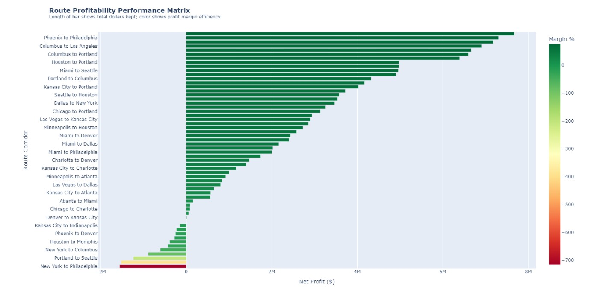
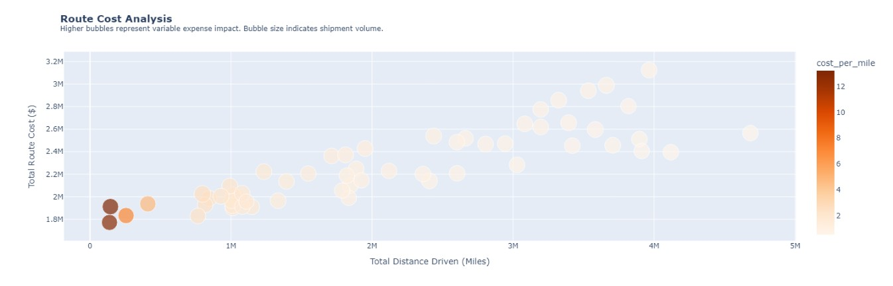
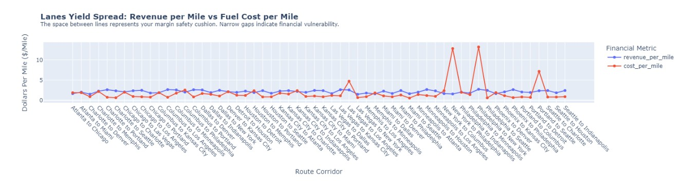
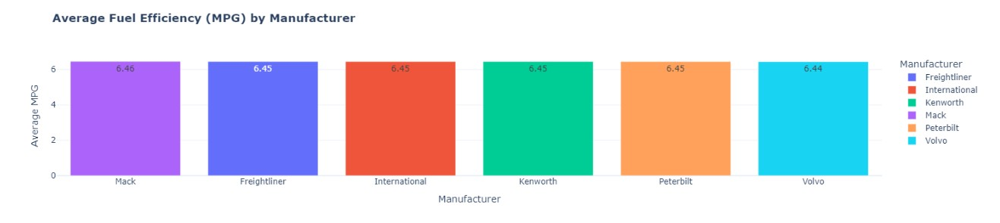
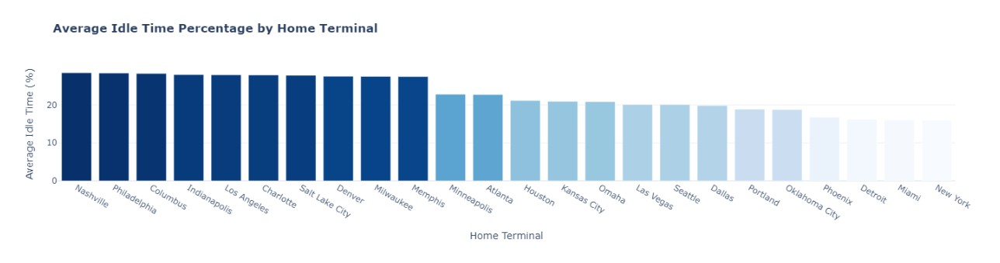
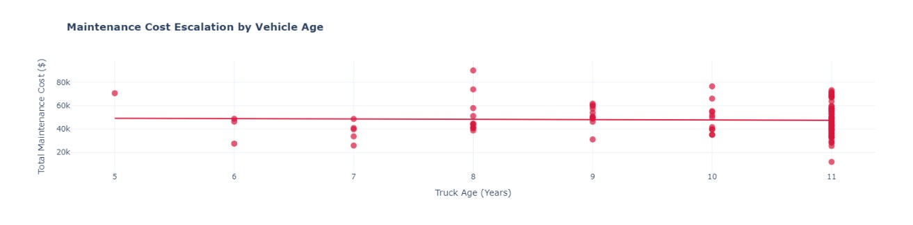

# 🚚 Logistics Data Analysis

## Project Overview

This project was completed as the final course project of a Data Analytics Weiterbildung Program at Alfatraining GmbH.

A fictional logistics company wanted to analyze its logistics operational data to identify opportunities for improving profitability and fleet performance.

The analysis focused on:

- Route Profitability Analysis
- Fleet Efficiency Analysis

The project covers the complete Data Analytics workflow:

✔ Data Loading  
✔ Data Cleaning  
✔ Exploratory Data Analysis (EDA)  
✔ Data Aggregation & Table Integration  
✔ Data Visualization  
✔ Business Insights & Recommendations

---

## Business Objective

The goal was to analyze logistics operations and answer key business questions such as:

### Route Profitability

- Which routes are the most profitable?
- Which routes generate the highest costs?
- Which routes provide the highest profit per mile?

### Fleet Efficiency

- How does truck age impact maintenance costs?
- Which manufacturers achieve the best fuel efficiency?
- Which terminals have the highest idle time?
- Which trucks have the highest operational costs?
- Which trucks are most and least utilized?

---

## Dataset

The dataset represents a realistic logistics operation spanning three years.

### Dataset Highlights

- 85,000+ records
- 14 interconnected tables
- 57,000+ loads and trips
- 131,000+ fuel purchase records
- 6,500+ maintenance records

### Main Tables

- Drivers
- Trucks
- Trailers
- Customers
- Routes
- Loads
- Trips
- Fuel Purchases
- Maintenance Records
- Delivery Events

---

## Tools & Technologies

- Python
- Pandas
- NumPy
- Matplotlib
- Seaborn
- Jupyter Notebook

---

## Project Structure

```text
Logistics-Data-Analysis/
│
├── Data_LoadCleanAndEDA.py
├── Fleet_Efficiency_Analysis.py
├── Route_Profitability_Analysis.py
│
├── data/
├── visualizations/
├── requirements.txt
└── README.md
```

---

## Analysis Workflow

### 1. Data Preparation

- Loaded and explored datasets
- Handled missing values
- Removed duplicates
- Corrected data types

### 2. Data Modeling

- Aggregated operational data
- Joined multiple relational tables
- Created business KPIs

### 3. Analysis & Visualization

- Route profitability analysis
- Fleet efficiency analysis
- Cost and utilization analysis
- Business-focused visualizations

---

## Key Findings

> Replace the placeholders below with your actual results.

- XX% of routes achieved positive profit margins.
- Route ABC generated the highest profit per mile.
- Route XYZ had the highest operational cost.
- Manufacturer ABC achieved the best fuel efficiency.
- Trucks older than XX years showed significantly higher maintenance costs.
- Terminal ABC recorded the highest idle hours.
- Truck XYZ had the highest Total Cost of Ownership (TCO) per mile.

---

## Visualizations

### Route Profitability Analysis







### Fleet Efficiency Analysis

## Which Fleet Manufacturer has highest Fuel Efficiency?



## Which Home Terminals have high idle time?

.

## Does Maintenance Cost increase as Fleet ages?

.


### Maintenance Cost vs Truck Age


---

## How to Run the Project

### Clone the Repository

```bash
git clone https://github.com/yourusername/logistics-data-analysis.git
```

### Navigate to Project Folder

```bash
cd logistics-data-analysis
```

### Install Dependencies

```bash
pip install -r requirements.txt
```

### Run the Scripts

```bash
python Data_LoadCleanAndEDA.py

python Fleet_Efficiency_Analysis.py

python Route_Profitability_Analysis.py
```

---

## Requirements

Example `requirements.txt`

```text
pandas
numpy
matplotlib
seaborn
jupyter
```

---

## Skills Demonstrated

- Data Cleaning
- Exploratory Data Analysis (EDA)
- Data Wrangling
- Data Aggregation
- Relational Data Analysis
- Business Analysis
- Data Visualization
- Data Storytelling
- Insight Generation

---

## About Me

I am an aspiring Data Analyst with a background in Business, Engineering, and IT. I am currently building my portfolio through hands-on projects involving Python, SQL, Power BI, and Business Analytics.

**LinkedIn:** [Add Your Link]

**GitHub:** [Add Your Link]
